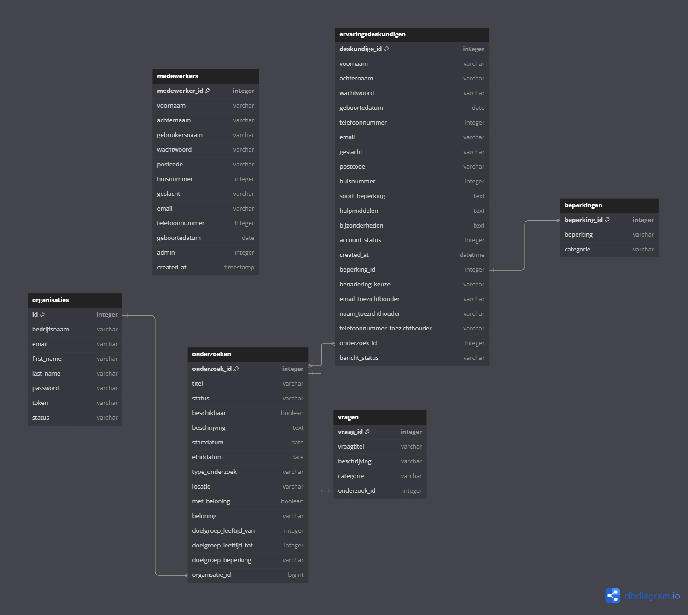

# Accessibility Hub
In deze applicatie kunnen mensen met een beperking zich aanmelden voor een onderzoek die is aangemaakt door een organisatie. De organisatie meldt zich aan voor de applicatie en moet worden goedgekeurd of afgekeurd door een medewerker van Accessibility. Als dit is gebeurd krijgt de organisatie een mail met daarin hun API key om toegang te krijgen tot het platform om onderzoeken aan te maken. Deze onderzoeken moeten ook worden goedgekeurd of afgekeurd door een medewerker van Accessibility. Als dat is gebeurd krijgen ze weer een mail. Ze kunnen ondertussen ook al onderzoeksvragen koppelen aan het onderzoek zodat de medewerker van Accessibility ziet wat er gevraagd gaat worden. Ervaringsdeskundige die zich hebben aangemeld voor het platform kunnen zich aanmelden voor een onderzoek die voor hun beperking is. Dit moet goedgekeurd worden door een medewerker van Accessibility en daarna kan de ervaringsdeskundige het onderzoek uitvoeren.

# Applicatie starten

Navigeer naar de main folder in het project. <br/>

Maak een virtual environment aan met het volgende commando: ```python -m venv venv``` <br/>

Activeer het virtual environment met het volgende commando: ```venv\Scripts\activate``` <br/>

Installeer de benodigde packages met het volgende commando: ```pip install -r requirements.txt``` <br/>

Start de applicatie met het volgende commando: ```python manage.py runserver``` <br/>

<strong>Login in met de volgende gegevens:</strong> <br/>

<strong>Medewerker</strong> <br/>
Gebruikersnaam: ```bryan``` <br/>
Wachtwoord: ```bryan``` <br/>

<strong>Ervaringsdeskundige</strong> <br/>
E-mailadres: ```semsem@gmail.com``` <br/>
Wachtwoord: ```test``` <br/>

# Functionaliteiten

**Accessibility Hub** <br/>

In de Accessibility Hub krijgen medewerkers van Accessibility live een update over nieuwe organisaties en onderzoeken. Zo kunnen zij gelijk zien wie zich heeft aangemeld voor de applicatie en welke onderzoeken er zijn aangemaakt om deze te kunnen goedkeuren of afkeuren. Medewerkers kunnen ook nieuwe medewerkers aanmaken binnen het platform om zo meer medewerkers toegang te geven tot Accessibility Hub. Medewerkers kunnen ook ervaringsdeskundige goedkeuren of afkeuren om ze toegang te geven tot het platform om onderzoeken uit te voeren voor de organisaties.

**Organisatie API** <br/>

De organisaties kunnen door een API zichzelf aanmelden, onderzoeken aanmaken en onderzoeksvragen inschieten voor een bepaald onderzoek. Dit moet allemaal worden goedgekeurd door medewerkers van Accessibility, als er goedkeuring of afkeuring is voor een organisatie of onderzoek dan krijgt de organisatie in kwestie hier een mail van.

De uitleg van de API is [hier](API.md) te vinden.

**Ervaringsdeskundige** <br/>

Een ervaringsdeskundige kan zich registreren voor het platform, dit moet daarna worden goedgekeurd door medewerkers van Accessibility, als er een goedkeuring is dan kan de medewerkers inloggen op het platform en zich aanmelden voor bepaalde onderzoeken in zijn beperking. Dit wordt goedgekeurd of afgekeurd door een medewerker van Accessibility en daarna kan de ervaringsdeskundige het onderzoek invullen.

**Database** <br/>

De ERD van de database staat hieronder. <br/>



# Hulpmiddelen

Wij hebben gebruikt gemaakt van verschillende bronnen en tutorials bij het ontwikkelen van deze game.

**Styling** <br/>

Voor de styling hebben wij gebruik gemaakt van Bootstrap zodat wij de applicatie een mooi uiterlijk konden geven.

**Tutorials** <br/>

https://www.digitalocean.com/community/tutorials/working-with-django-templates-static-files <br/>
https://www.youtube.com/watch?v=llrIu4Qsl7c <br/>
https://www.youtube.com/watch?v=PUzgZrS_piQ <br/>
https://www.youtube.com/watch?v=HHx3tTQWUx0 <br/>
https://www.youtube.com/watch?v=H3joYTIRqKk <br/>
https://www.youtube.com/watch?v=CVEKe39VFu8 <br/>
https://www.youtube.com/watch?v=Z3qTXmT0yoI&ab_channel=CloudWithDjango <br/>
https://www.youtube.com/watch?v=cu-1EdSMzK0&ab_channel=MyAcademy <br/>
https://www.youtube.com/watch?v=mndLkCEiflg&ab_channel=CodeWithStein <br/>
https://www.youtube.com/watch?v=mOS0L5Lb2u0&ab_channel=Desphixs <br/>
https://www.youtube.com/watch?v=Rhg-Ua6tM2w&t=449s&ab_channel=THESHOW <br/>
https://www.youtube.com/watch?v=ypAAh_Abjxs&t=386s&ab_channel=SelmiTech <br/>
https://www.youtube.com/watch?v=sbCd52JiCU4&t=1268s&ab_channel=CodingWithMitch <br/>
https://www.youtube.com/watch?v=SFarxlTzVX4&t=1915s&ab_channel=CodingWithMitch <br/>
https://www.youtube.com/watch?v=Pc4SF7bSkMs&t=473s&ab_channel=CodingEntrepreneurs <br/>

**Websites** <br/>

https://www.sololearn.com/en/Discuss/2304405/in-python-if-the-user-doesnt-enters-a-input-and-simply-press-submit-button-if-this-is-situation-then-how-to-set-default-value <br/>
https://docs.djangoproject.com/en/5.0/ref/contrib/auth/#:~:text=It%20authenticates%20using%20credentials%20consisting,see%20Customizing%20Users%20and%20authentication <br/>
https://docs.djangoproject.com/en/5.0/topics/auth/default/ <br/>
https://reintech.io/blog/writing-custom-authentication-backend-django <br/>
https://dev.to/amoabakelvin/creating-a-custom-authentication-backend-in-django-17bl <br/>
https://reintech.io/blog/building-a-custom-authentication-system-in-django <br/>
https://stackoverflow.com/questions/57556793/login-check-the-username-and-password-from-database-in-django-website-using-post <br/>
https://stackoverflow.com/questions/70644038/get-data-from-one-column-in-database-django <br/>
https://www.sololearn.com/en/Discuss/2304405/in-python-if-the-user-doesnt-enters-a-input-and-simply-press-submit-button-if-this-is-situation-then-how-to-set-default-value <br/>
https://www.w3schools.com/django/django_queryset_filter.php#:~:text=The%20filter()%20method%20takes,separating%20them%20by%20a%20comma. <br/>

**Algemeen** <br/>

We hebben ook gebruikt gemaakt van AI zoals GitHub CoPilot en hebben wij bij sommige vraagstukken gebruikt gemaakt van
ChatGPT om uit te zoeken waar iets fout ging in onze code of om duidelijk uit te leggen wat bepaalde foutmeldingen
betekende en waar we dit konden oplossen in onze code. 

De prompts van ChatGPT staan in dit [bestand](chatgpt.md).

# Ervaringsdeskundige ophalen met AJAX, Sem
Ik heb als aanpassing gedaan om toch nog in aanraking te komen met ajax ervoor gekozen om deskundige in real-time op te halen. Dit heb ik gedaan met hulp van de ajax workshop die ik gevolgd heb en met het kijken naar de code die Bryan had geschreven voor de API. Dit was echter best lastig om te maken. Ook heb ik een aantal video's en sites bekeken voor informatie. 

https://www.youtube.com/watch?v=S2gkqC1fmbA&ab_channel=RedEyedCoderClub
https://www.brennantymrak.com/articles/fetching-data-with-ajax-and-django
https://testdriven.io/blog/django-ajax-xhr/

**Login** <br/>

Sem heeft veel tijd en werk in de login gestoken en veel opgezocht op het internet om dit werkend te krijgen, hij heeft al deze bronnen bewaard in dit [bestand](login.md). Uiteindelijk is het gelukt met hulp van Mark en verschillende bronnen. Sem heeft netjes gedocumenteerd wat hij heeft gebruikt en waarom dit niet werkte of deels werkte om het probleem op te lossen.
